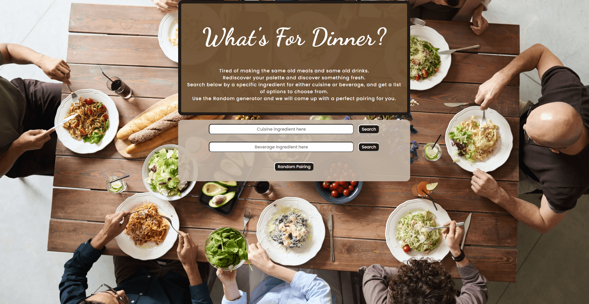

# **What's For Dinner?**

This app was designed for an API Capstone project for the Thinkful.

Live App: https://alex-putnam.github.io/meal-app/

GitHub Repo: https://github.com/alex-putnam/meal-app

## **What's For Dinner? Description**

What's for Dinner? is an app that lets users find food and drink recipes through a couple of ways. Users can either search by ingredient which then gives users options to choose from. If the user presses the "Random Pairing" button, a randomly generated food recipe and drink recipe will become available. What's For Dinner? used two API Databases to recieve all of the users requests and return their responses. To handle all food recipes, TheMealDB API is used, and to handle all drink recipes, TheCocktailDB API is used.

## Screenshot:

## Built With

- HTML
- CSS
- JavaScript
- jQuery

## API Databases

- [TheMealDB](https://www.themealdb.com/api.php)
- [TheCocktailDB](https://www.thecocktaildb.com/api.php)
